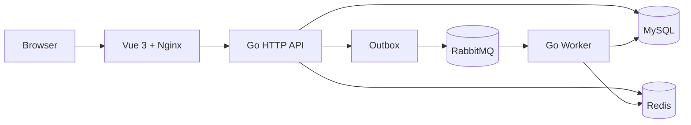

# my_feed_system

> 一个面向短视频场景的 Feed 流系统：Go API + 异步 Worker + Vue 3 Web 应用。

[](https://go.dev/)
[](https://vuejs.org/)
[](https://docs.docker.com/compose/)

## 项目亮点

- 多种 Feed：最新流、关注流、点赞排行和热度排行。
- 异步写入：RabbitMQ Worker 处理点赞、评论、社交、时间线和热度任务。
- 一致性设计：Outbox、幂等、消息去重和死信处理降低异步失败风险。
- 分层缓存：Redis 配合本地缓存加速 Feed、视频详情和热度数据。
- 可观测性：提供指标和 pprof 入口，便于定位运行时问题。
- 可复现启动：Docker Compose 一次启动 API、Worker、前端和基础设施。

## 系统结构



API 负责同步请求和公开 HTTP 接口，Worker 独立消费异步任务。两者共享配置和基础设施，但保持进程职责分离。

## 功能范围

| 模块 | 能力 |
| --- | --- |
| 账号 | 注册、登录、登出、改名、改密、资料查询 |
| 视频 | 上传、发布、详情、作者视频、点赞视频 |
| Feed | 最新流、关注流、点赞排行、热度排行、游标分页 |
| 互动 | 点赞、取消点赞、评论、回复、删除、关注、取关 |
| 工程能力 | Redis 缓存、RabbitMQ Worker、Outbox、幂等、限流、指标、pprof |

## 快速启动

### 环境要求

- Docker Desktop 或 Docker Engine
- Docker Compose

### Compose 启动

```bash
git clone git@github.com:Lygxiaobai/my_feed_sytem.git
cd my_feed_sytem

# 准备凭据：仓库中不含任何真实密钥，必须先生成
cp .env.example .env
# 编辑 .env 填入 MYSQL_ROOT_PASSWORD / RABBITMQ_PASSWORD / JWT_SECRET
# JWT_SECRET 至少 32 位，可用下面命令生成：
#   openssl rand -base64 48

docker compose up -d --build
```

启动后访问：

| 服务 | 地址 |
| --- | --- |
| Web 前端 | <http://localhost:5173> |
| API 健康检查 | <http://localhost:8080/ping> |
| RabbitMQ 管理台 | <http://localhost:15672> |

所有凭据均通过环境变量注入，仓库内不存放任何真实密钥。缺少必需变量时，服务会在启动阶段直接失败并一次性列出缺失项，不会以空密码或空密钥静默启动。

停止服务：

```bash
docker compose down
```

同时删除本地数据卷：

```bash
docker compose down -v
```

> `down -v` 会删除 MySQL、Redis、RabbitMQ 和上传文件的本地持久化数据，请确认后再执行。

## 本地开发

### 首次准备

后端启动时会读取工作目录下的 `.env` 补齐环境变量，该文件已被 `.gitignore` 排除：

```powershell
cd .\backend
copy .env.example .env
```

编辑 `backend/.env`，至少填写三项：

| 变量 | 说明 |
| --- | --- |
| `MYSQL_PASSWORD` | 本地 MySQL 的 root 密码 |
| `RABBITMQ_PASSWORD` | 本地 RabbitMQ 密码，默认安装通常是 `guest` |
| `JWT_SECRET` | JWT 签名密钥，至少 32 位，用 `openssl rand -base64 48` 生成 |

其余配置项都有默认值，不设置即可。已存在的环境变量优先于 `.env`，便于临时覆盖：

```powershell
$env:LOG_LEVEL = "debug"; go run ./cmd
```

漏填时启动会直接失败并指明缺什么，不会带着空密钥跑起来：

```
启动失败: 配置缺少必需的环境变量: MYSQL_PASSWORD, JWT_SECRET（本地开发可复制 backend/.env.example 为 backend/.env 并填写）
```

### 后端 API

```powershell
cd .\backend
go run ./cmd
```

### 异步 Worker

```powershell
cd .\backend
go run ./cmd/worker
```

### 前端

```powershell
cd .\frontend
npm install
npm run dev
```

前端开发服务器默认运行在 `127.0.0.1:5173`，通过 Vite 代理访问本地 API。后端默认开发端口为 `127.0.0.1:8081`，代理规则见 [`frontend/vite.config.ts`](./frontend/vite.config.ts)。

## 可观测性

Compose 会一并启动 Prometheus、Loki、Grafana Alloy 和 Grafana。四者**只监听 `127.0.0.1`**，不对外开放端口，通过 SSH 隧道访问：

```bash
ssh -L 3000:127.0.0.1:3000 <your-server>
# 然后浏览器打开 http://localhost:3000
```

登录账号来自 `.env` 的 `GRAFANA_USER` / `GRAFANA_PASSWORD`。数据源与「Feed 系统总览」仪表盘会自动装配，无需手工配置。

| 组件 | 作用 | 保留期 |
| --- | --- | --- |
| Prometheus | 抓取 API 的 RED 指标与缓存指标 | 15 天 / 2 GB |
| Loki | 汇总全部容器日志，按 `service`、`level` 建索引 | 7 天 |
| Grafana Alloy | 从 Docker socket 采集日志推送到 Loki | — |
| Grafana | 仪表盘与日志检索 | — |

采集端用 Alloy 而非 Promtail：后者已于 2026-03-02 EOL。日志经 Docker socket 读取，不替换 logging driver，因此 `docker logs` 仍可正常使用。

排查线上问题的常用入口：

- **按请求追踪**：拿用户报错里的 `requestId`，在 Grafana 的 Loki 面板执行
  `{service=~"backend|worker"} |= "<requestId>"`
- **只看错误**：`{service=~"backend|worker", level=~"ERROR|WARN"}`
- **不开 Grafana 时**：`docker logs my-feed-system-backend 2>&1 | grep '"level":"ERROR"'`

## 配置与部署边界

- Compose 使用 [`backend/configs/config.docker.yaml`](./backend/configs/config.docker.yaml) 作为容器配置模板。
- 本地手动运行使用 [`backend/configs/config.yaml`](./backend/configs/config.yaml)。
- 两份配置中的敏感项一律写成 `${VAR}` 占位符，非敏感项写成 `${VAR:-默认值}`，仓库内不出现任何真实凭据。
- `${VAR}` 为必填：未设置时启动失败并一次性列出全部缺失变量，不会静默展开成空值。
- `jwt.secret` 在启动时校验长度（至少 32 位），阻止弱密钥进入运行环境。
- 取值优先级：进程环境变量 > `.env` 文件 > 配置文件中的默认值。
- Cloudflare、域名和外部反向代理属于部署环境配置，不属于本项目代码契约。

## 项目文档

- [`AGENTS.md`](./AGENTS.md)：Agent 开发流程和项目级约束。
- [`.spec/`](./.spec/)：业务行为、架构边界和验证场景。
- [`my_feed_system系统设计说明.md`](./my_feed_system系统设计说明.md)：系统设计说明。
- [`docker-compose.yaml`](./docker-compose.yaml)：本地 Compose 启动编排。

## 仓库结构

```text
backend/      Go API、Worker 和业务模块
frontend/     Vue 3 + Vite Web 应用
nginx/        本地代理和开发辅助脚本
.spec/        行为与架构契约
AGENTS.md     Agent 工作规则
```

## 验证

```bash
# 前端类型检查与生产构建
cd frontend
npm run build

# 后端测试
cd ../backend
go test ./...
```

项目的行为场景和架构约束以 [`.spec/`](./.spec/) 为准；实现变更后应同步检查对应的 `spec.md` 和 `eval.md`。
